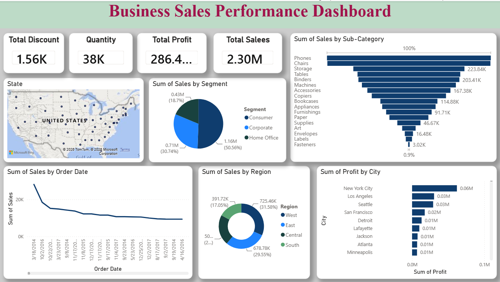

# Business Sales Performance Analytics Dashboard

## Project Overview

This project was completed as part of the Future Interns Data Science & Analytics Internship (Task 1).

The objective is to analyze business sales data and build an interactive Power BI dashboard that provides meaningful business insights.

---

## Objectives

- Analyze sales performance
- Identify top-selling products
- Compare sales across categories and regions
- Analyze profit trends
- Provide business recommendations

---

## Dataset

Dataset Used:
Superstore Sales Dataset

Main Features:
- Order Date
- Sales
- Profit
- Category
- Sub-Category
- Region
- Customer Segment
- Quantity
- Discount

---

## Tools Used

- Microsoft Excel
- Power BI
- GitHub

---

## Dashboard Features

- Total Sales KPI
- Total Profit KPI
- Total Orders KPI
- Profit Margin
- Monthly Sales Trend
- Sales by Category
- Sales by Region
- Top 10 Products
- Customer Segment Analysis

---

## Business Insights

- Technology generated the highest sales.
- West region had the highest revenue.
- High discounts reduced profits.
- Furniture had lower profit margins.

---

## Recommendations

- Increase investment in Technology products.
- Reduce excessive discounts.
- Focus marketing on high-performing regions.
- Improve performance in low-profit categories.

---

## Repository Structure

FUTURE_DS_01/

├── [Sales Data](Superstore.csv)

├── [Dashboard](sale1.pbix)

├── [report](sales1.pdf)

├── [Image]

└── README.md

---

## Dashboard Preview

---

## Author

**Santhi Priya**

Future Interns – Data Science & Analytics Intern
